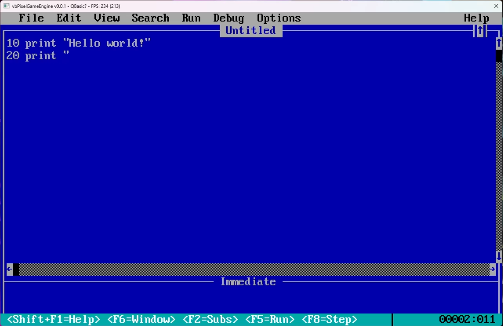
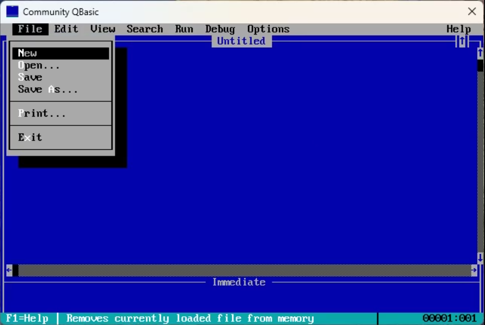
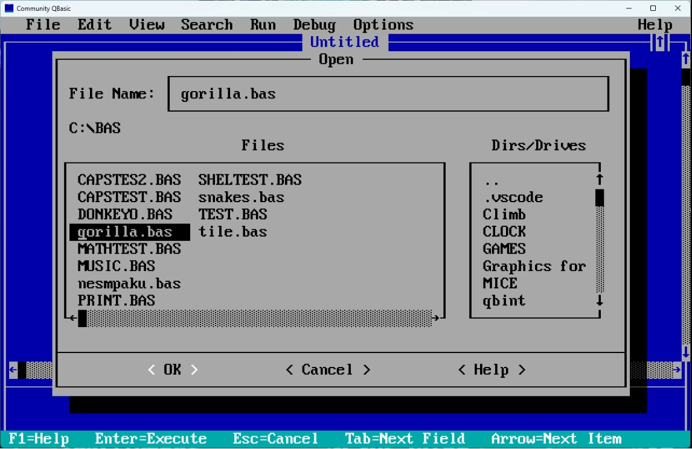
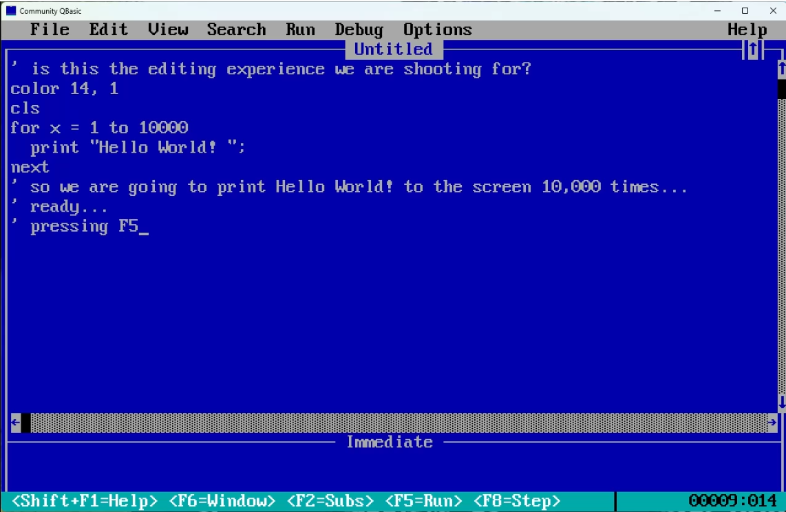

# QBasic

I posit the following question:

> What if there were a *true* replacement to QBasic?

By "*true* replacement", what does that even mean?

In my mind, the be considered a *true* replacement to QBasic a few things must be true:

- The overall editing/using experience should be nearly identical to the original; and by nearly I mean that if there are any changes - those should be in the way of improvements, not changes for the sake of changes.
- Which leads me to this point... I should be able to grab any published material for QBasic and the material should be applicable to the replacement; meaning it should "just work". If there are any exceptions where something "doesn't work"; it should be because it simply isn't possible, not because some arbitrary choice was made.
- It should be fast... at least as fast as the original, in all ways (but one would hope faster).

Which raises further questions such as:

- What would it look like?
- How fast could it run?
- What would the overall Edit/Run (F5) experience be?
- Could it be cross-platform?
- What modern language would it be built in?
- How close to the original could it really be?
- What advantages would there be in doing so?
- Would anyone care?
- What exceptions, if any, will there be to the "just work"?
- Are there any "glass ceiling" circumstances where it can still work similarly (retaining the "just works")... but significantly improved?
- And then what? What, if any, areas can be added/improved upon beyond what was in the original while still retaining the "just works" goal?

Some of these questions are pretty easy to answer, while others are certainly in the *wait and see category*.

## Progress?

](images/2024-01-22_14-12-57.png)

The above video demonstrates some of the overall UI elements; screen layout, main menu functionality and very initial (minimal) work on some fo the dialogs (message boxes) as well as showing the initial work on the "multiple windows" feature.

And now we have (very limited) text editing capability.

[ [watch](videos/2024-01-29_14-37-49.mp4) ]

This short video demonstrates toggling of insert/overwrite as well a reproducing the original "blinking cursor" and the *key repeat* functionality.

[ [watch](videos/2024-02-03_01-07-17.mp4) ]

Here you can see some of the progress being made on the various dialogs.

[ [watch](videos/2024-02-04_23-50-19.mp4) ]

Let's write a bit of code and see if we can answer one of the original questions raised above?

## FAQ

### What is it written in?

This seems to be the most asked question and it's kind of funny as even if you know the answer, does it really matter. However, in this particular case the choice of what language to write it is was very specifically chosen with purpose. The answer is that it is written in VB... yes... VB. With VB and .NET (current version as of writing this is 8.0) not only allow for cross-platform development but also provides a potential growth path and (hopefully) future contributions to the project by those using QBasic; the knowledge gained and the enjoyment experienced can directly be applied to contribute to the very project that provided such.

### What frameworks are you using?

Another question asked is am I utilizing something like SDL2, GTK, FNA, etc. So it's a little tricky to answer as the answer is both a yes and a no as there is a "framework", but I'm also the author of said framework and that framework doesn't, itself, use any of these other frameworks. So the most direct answer I can give is that it is leveraging the OS API's directly as much as feasible. This might change, but as long as it is possible to remain as minimal with the layers as possible - will remain doing so. For more details on this "layer", please check see [vbPixelGameEngine](https://github.com/DualBrain/vbPixelGameEngine).

### Can we see the code?

It will eventually be made available in whole, but if you'd like to peek under some of covers... take a look at the [vbPixelGameEngine](https://github.com/DualBrain/vbPixelGameEngine).

### Why do this?

Why not?

### Hasn't this already been done?

One would think so, but truthfully the answer is no. There were two projects in the past that set out to do this. One of those is [FreeBASIC](https://www.freebasic.net/) and has since evolved to a point where it really isn't anything close to what QBasic was. Please don't misunderstand me, I think [FreeBASIC](https://www.freebasic.net/) is an incredible product and highly recommend giving it a close look, but it certainly isn't a replacement to QBasic. The other project was originally created with a very similar set of questions as I pose above by someone named Rob Galleon at some point in the mid-2000's and created what eventually became known as [QB64](https://qb64.com/). The goal was for it to be "designed 'from the ground up' to be 100% compatible with QB4.5/QBASIC" and, unfortunately, never really met that goal. And like a lot of projects, scope creep drove the project forward into becoming, well, "something else". Again, not saying that it is a bad thing... just that it isn't a replacement to QBasic. At some point I imagine the pressure from the community to take the project into different directions than what he originally intended and the constant onslaught of this pressure led to his walking away from the project. As it currently stands, the project has evolved enough into its *own thing* that any sort of course-correction to get it back on track to reach the originally stated goal would cause enough "breaks" that it really doesn't make sense to pursue. It is what it is and for those that enjoy what it is, it's great for them. But, as I stated, it isn't a replacement for QBasic.

And besides, why should the fact (even if true) of someone else doing this prevent me from wanting to give it a solid try? 🤠

### How long have you been working on this?

That is kind of a difficult question to answer as it's something that has been evolving to this point for well over a decade. Many years ago I completed a (somewhat) similar project... *GW-BASIC for Windows Phone* (which also worked in Microsoft Silverlight and the Xbox 360). With the demise of these platforms, the question was "what now?". Making it for Windows was an option, but for whatever reasons it just didn't excite me. The issue is that I didn't want to limit the scope of target audience and I really wanted to have something that could work on Windows and, at minimum, Raspberry Pi. The issue is that as a secondary goal, I really wanted to do this using VB and .NET... and .NET was clearly marching forward for more cross-platform capability whether in the form of actual the .NET Framework and crowd (including .NET Micro Framework, .NET Compact Framework, Mono, etc.) but there still remained the issue of cross-platform UI as well as the multiple assemblies issue... and why not throw in the whole CLR, JIT, runtime requirement. But I was aware that work was taking place... so just had to let some time march along. I've since given up on the idea of a cross-platform UI as all the ones available seem to complicate things to the point that asking the simple question of "how do I draw a single pixel to the screen?" difficult to answer. It shouldn't be this difficult... so I set out to find another solution. That took the form of [vbPixelGameEngine](https://github.com/DualBrain/vbPixelGameEngine); answering the most direct question of "how do I draw a single pixel to the screen?" and do so on Windows and Linux (i.e. Raspberry Pi OS). Additionally, the tooling for .NET has progressed beyond *The .NET Framework* and is now simply *.NET*; and in this new generation of .NET it is not only possible to solve the multiple assemblies problem, but it now offers native compiler support ("AOT"). So this means it is possible to use VB, the power and scope of the .NET ecosystem and yet end up with a native executable for not only Intel/AMD but Arm processors with full cross-platform interop capabilities... who would have taken that bet 15+ years ago?

So the shorter answer is that portions of the project been a work-in-progress for a long time where all things really started to come together at the beginning of 2024.

### When will it be ready?

It's certainly a work-in-progress at this point, so I'll just have to answer this with a "when it's ready, it's ready" type of answer.

### No really, when will it be ready?

It's not ready just yet, but if you'd like to be involved sooner rather than later... I'm considering providing early access to those willing to help offset the costs of the project by either using [GitHub](https://github.com/DualBrain) or [Patreon](https://www.patreon.com/corysmith). If financial contributions is out of the questions, please feel free to contact me if you are interested in contributing in some other manner.

### How to contact you?

The best place to reach out to me is on the [gotBASIC Discord](https://discord.gg/AYcgDwERUU) server; here's the [invite](https://discord.gg/AYcgDwERUU).
