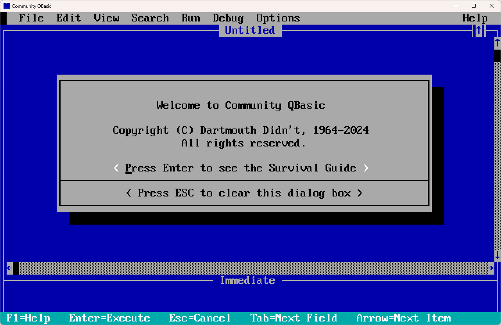

# Introducing the *Community QBasic* Project

It all started with the following question...

> What if there were a *true* replacement to QBasic?

By "*true* replacement", what does that even mean?

In my mind, the be considered a *true* replacement to QBasic a few things must be true:

- The overall editing/using experience should be nearly identical to the original; and by nearly I mean that if there are any changes - those should be in the way of improvements, not changes for the sake of changes.
- Which leads me to this point... I should be able to grab any published material for QBasic and the material should be applicable to the replacement; meaning it should "just work". If there are any exceptions where something "doesn't work"; it should be because it simply isn't possible, not because some arbitrary choice was made.
- It should be fast... at least as fast as the original, in all ways (but one would hope faster). 🤠

Which raises many additional questions such as:

- What would it look like?
- How fast could it run?
- What would the overall Edit/Run (F5) experience be?
- Could it be cross-platform?
- What modern language would it be built in?
- How close to the original could it really be?
- What advantages would there be in doing so?
- Would anyone care?
- What exceptions, if any, will there be to the "just work"?
- Are there any "glass ceiling" circumstances where it can still work similarly (retaining the "just works")... but significantly improved?
- And then what? What, if any, areas can be added/improved upon beyond what was in the original while still retaining the "just works" goal?

Some of these questions are pretty easy to answer, while others are certainly in the *wait and see category*.
