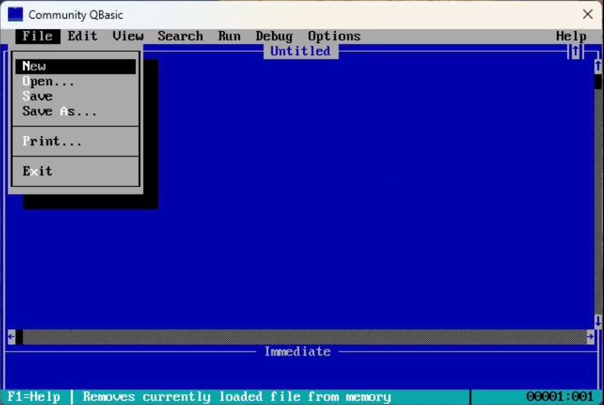

# Progress?

## 2024-01-22

The above video demonstrates some of the overall UI elements; screen layout, main menu functionality and very initial (minimal) work on some fo the dialogs (message boxes) as well as showing the initial work on the "multiple windows" feature.

## 2024-01-24

And now we have (very limited) text editing capability.

## 2024-01-29

This short video demonstrates toggling of insert/overwrite as well a reproducing the original "blinking cursor" and the *key repeat* functionality.

## 2024-02-03

Here you can see some of the progress being made on the various dialogs.

## 2024-02-04

Let's write a bit of code and see if we can answer one of the original questions raised above?
